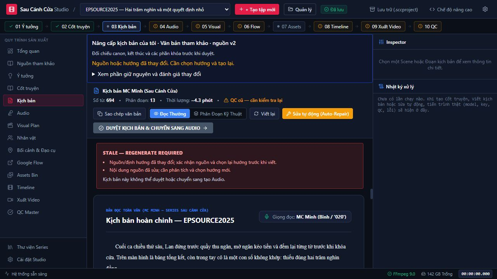
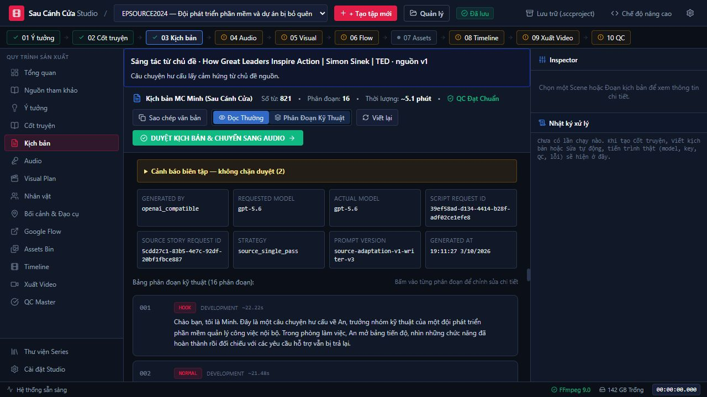

# Nghiệm thu: Tạo kịch bản từ nguồn tham khảo

Ngày: 03/10/2026. Kế hoạch điều phối: [SOURCE_TO_SCRIPT_PLAN.md](SOURCE_TO_SCRIPT_PLAN.md).
Baseline: `559187bb89e3623d00b0e4974f05d493da0a4179`.

## Kết luận và phạm vi

Bản đầu đã triển khai và nghiệm thu ba chế độ qua Studio UI production: kể lại chuyện thật, hư cấu từ chủ đề và nâng cấp kịch bản tự viết. Có nhập văn bản/file UTF-8 TXT/SRT/VTT, đọc bài báo, lấy phụ đề một video YouTube, preview/edit/confirm, ba hướng khai thác, chọn hướng, Story, Script, QC, duyệt và cổng Audio. Đã đọc toàn văn ba đầu ra và đối chiếu nguồn, không chỉ dựa vào badge PASS.

Web nghiệm thu: **http://127.0.0.1:8766/**. Giữ phiên người dùng ở `8765` chạy; process cũ chưa nạp backend mới. Cả hai dùng cùng repo, dist và kho project. Muốn dùng tính năng mới ngay, mở `8766`; lần khởi động bình thường kế tiếp của launcher sẽ nạp backend mới ở cổng chính.

AI chạy qua **OpenAI-compatible đã cấu hình trong app**, response/metadata báo `gpt-5.6`. Đây là tên model do proxy báo, không phải xác minh độc lập model phía sau proxy. Không thay key/model của người dùng.

Nghiệm thu dừng ở tạo kịch bản và kiểm tra cổng Audio. **Không chạy TTS hoặc render video cho ba tập này.** Không thay Audio Formula V1, giọng Binh/020, BGM, Visual/Flow hoặc assembler. Không kết luận mọi đầu ra AI đều hay hoặc mọi URL đều đọc được.

## Ba tập mới qua luồng UI thật

| Project / chế độ | Tiêu đề Script | Nguồn | Từ / đoạn | Mục tiêu / ước tính | Kết quả |
|---|---|---|---|---|---|
| EPSOURCE2023 / FACTUAL_RETELLING | Một ngày tại Tổ hợp 0 đồng | Bài VnExpress, 908 từ | 904 / 17 | 300s / 334.81s | QC PASS, APPROVED, Audio gate mở |
| EPSOURCE2024 / FICTION_FROM_THEME | Bảng tính năng bị bỏ lại | TED/Simon Sinek, 3015 từ, phụ đề thủ công tiếng Anh | 821 / 16 | 300s / 304.07s | QC PASS với 2 cảnh báo biên tập, APPROVED, Audio gate mở |
| EPSOURCE2025 / IMPROVE_OWN_SCRIPT | Hai trăm nghìn cuối ca | Fixture tự viết “Cuốn sổ cuối ca”, 500 từ | 694 / 13 | 240s / 257.03s | QC PASS, đã duyệt/mở Audio; sau thử sửa nguồn v2: STALE và gate khóa |

Thời lượng là **ước tính 2.7 từ/giây**, không phải thời lượng WAV. Các lần duyệt đều bấm từ UI, chuyển sang Audio và xác nhận giọng 020/nút TTS mở. Không bấm sinh Audio. Reload browser và restart backend nghiệm thu giữ nguyên request ID/content hash/approval; cuối cùng EPSOURCE2025 được để STALE có chủ ý để kiểm chứng invalidation.

| Project | Story generation_request_id | Script generation_request_id | Prompt Script cuối | Revision round |
|---|---|---|---|---|
| EPSOURCE2023 | `44a9404d-a7fc-4943-9b0d-5c2176f8b5db` | `2fb1d098-2bfd-4cf1-af0d-884aa893955d` | `script-v3.9-calendar-payoff-location-repair` | 2 |
| EPSOURCE2024 | `5cdd27c1-83b5-4e7c-92df-20bf1fbce887` | `39ef58ad-d134-4414-b28f-adf02ce1efe8` | `source-adaptation-v1-writer-v3` | 0 |
| EPSOURCE2025 | `c4e9570e-73e4-48b7-a4e0-5d1012bf8fe6` | `5db53410-359e-4333-9641-b43f6d5e4c25` | `source-adaptation-v1-writer` | 0 |

Không sửa tay Script/JSON để nghiệm thu. Trước bản cuối có các lần bị QC/reviewer từ chối và hai bản hư cấu bị người kiểm tra từ chối vì quá tóm tắt. Đã sửa planner/writer/reviewer ở tầng code rồi sinh lại qua UI. Các con số revision trong bảng là metadata của artifact cuối, không phải tổng số cuộc gọi thử nghiệm.

### Đọc thủ công

- **Factual:** đối chiếu [bài gốc](https://vnexpress.net/to-hop-0-dong-giua-long-ha-noi-4103695.html), giữ người thật/địa chỉ 19L/diện tích 40m²/thư viện 500→1000 sách và trải nghiệm được nguồn mô tả. Kế hoạch tương lai vẫn là kế hoạch; không thêm lời thoại, thú nhận hoặc kết cục ngoài nguồn. Bản kể trung thực, theo dõi được; phần mở/kết còn nhắc lại chủ đề, chưa gọi là tác phẩm tối ưu giữ chân người xem.
- **Fiction:** đối chiếu [video nguồn](https://www.youtube.com/watch?v=qp0HIF3SfI4). Câu chuyện mới về An/Linh/Hải/Trang, nhiệm vụ cụ thể là phiếu cấp lại quyền truy cập tài liệu đào tạo cho nhân viên mới. Có thao tác bị kẹt, quyết định hoãn ba tính năng, lo ngại lịch phát hành, sửa biểu mẫu/chuyển phiếu và kết quả Trang gửi thành công. Có thoại ngắn; không dùng chuỗi ví dụ/câu thoại của TED làm cốt truyện đổi tên. Nhãn hư cấu rõ. Chấp nhận cho bản đầu, không chứng nhận nguyên bản hay hấp dẫn bằng điểm phần trăm.
- **Own script:** giữ Lan/Hạnh/Phúc/Thu, thiếu 200 nghìn do nhập đơn ghi nợ thành tiền mặt; Lan định bù nhưng không bù, ghi chênh lệch, cùng kiểm tra sáng thứ bảy, Thu trả cuối tháng, Lan tiếp tục làm và có hai chữ ký bàn giao. Không đảo thành trộm cắp/kết thúc mới. Có hành động và nguyên nhân→kết quả, lời bình có thể biên tập ngắn thêm trước đăng.

Ba bản cuối có hai lượt review native có grounding và hai lượt review nguồn độc lập; toàn bộ items được review ở mỗi pass. Source QC `script-qc-v5.7-source-props`, semantic `semantic-v18-source-task-pacing`; leakage theo gate hiện có bằng 0. Không đồng nghĩa với đã chứng minh mọi lỗi ngữ nghĩa đều không thể xảy ra.

### Hai cảnh báo còn ở EPSOURCE2024

`ADJACENT_SEGMENT_ECHO`: đoạn 016 nhắc lại “bảng mục tiêu sử dụng” vừa xuất hiện ở 015. Đây là callback cuối bài ngắn nhưng còn trùng ý, không phải diễn biến mới; có thể rút gọn khi biên tập.

`MISSING_FINAL_SIGNOFF`: validator cũ đòi mẫu lời chào cụ thể, trong khi đoạn ENDING cuối có “Cảm ơn bạn đã theo dõi Sau Cánh Cửa, hẹn gặp lại…”. Báo cáo lưu cảnh báo thực, không xóa để làm sạch PASS. Hai entries có `blocking=false` theo chính sách biên tập hiện có; không dùng chúng để bỏ qua lỗi canon/nguồn/logic thật. Xem `qc_warnings` trong [metadata](source-evidence/EPSOURCE2024-before-source-edit.json).

## Invalidation có đối chứng

Sau khi EPSOURCE2025 được duyệt, sửa **nguồn tự viết** bằng UI và xác nhận thêm ghi chú 15 từ. Nguồn v1→v2, 500→515 từ, hash thay đổi và history v1 được giữ. Brief/Story/Script/QC và downstream STALE; Script stage DRAFT, approval hash bị xóa. Script cũ/request ID/content hash được giữ để xem nhưng `is_current=false`, `audio_gate_allowed=false`.

Reload vẫn STALE, nút duyệt và nút sinh TTS bị khóa. Header hiện **“QC cũ — cần kiểm tra lại”**, không hiển thị PASS lịch sử như QC hiện hành. So sánh [trước](source-evidence/EPSOURCE2025-before-source-edit.json) / [sau](source-evidence/EPSOURCE2025-after-source-edit.json).

## Các vấn đề code phát hiện và xử lý trong nghiệm thu

1. Pipeline mystery ép lá thư/hai reveal/số đoạn/câu hỏi không phù hợp nguồn: bổ sung adaptation profile và kiểm tra nguồn; giữ profile native ở project không có nguồn.
2. Hư cấu chỉ tóm tắt bài học: planner bắt task_design/concrete_instance/key_scenes có hành động, quyết định, cái giá và kết quả; writer hiện thực bằng cảnh/thoại. Writer chỉ nhận theme/brief tối giản, không toàn transcript gốc.
3. Reviewer trả quote/field sai: kiểm chứng quote đúng artifact/item; unique exact source quote được map ID thật và lưu ID báo ban đầu. Alias `key_scenes` chỉ map sang cùng trường `narrative_skeleton.key_scenes`, quote vẫn phải thật. Quote bịa/diễn giải/mơ hồ/trường lạ fail closed; retry báo cáo một lần, không sửa truyện để hợp thức báo cáo.
4. Source Story đã duyệt có QC lỗi: fail fast khi sinh Script, không âm thầm sáng tác lại upstream đã khóa.
5. Writer vượt/thiếu thời lượng: budget theo 2.7 từ/giây ±15%, retry có giới hạn và báo chính xác phần thiếu/thừa. Không kéo dài bằng lặp hoặc bịa sự kiện factual.
6. Từ như “khó khăn/ảnh hưởng/thư viện/hộp thoại” bị bắt thành đạo cụ: disambiguation cho profile nguồn; giữ kiểm tra đồ vật thật có setup chưa giải quyết.
7. Job/race/reload: persisted bounded jobs, idempotency, source/brief snapshot trước và sau ghi artifact, orphan sau restart báo lỗi; UI không dùng callback của project cũ. Atomic write có retry sharing violation Windows giới hạn. Log epoch chống cursor cũ sau restart.
8. UI lịch sử QC và toolbar: phân biệt QC cũ khi STALE, wrap toolbar ở màn hẹp, metadata provider/model/request/version và nhãn chế độ rõ.

## Kiểm thử và dist

- Focused: **119 passed + 6 subtests** (`test_source_adaptation`, semantic, outline, contract, lineage, live log).
- Riêng source regression: **50 passed**. Có đối chứng URL nội bộ/redirect/pinned DNS, captions tự động/lặp/thiếu, source instruction giả, quote sai, khóa canon, budget, race/restart/idempotency, upstream approved fail-fast.
- Full suite chạy trên clone cô lập: **704 passed, 15 failed, 10 errors, 5 skipped, 6 subtests**, 167.51s.
- Baseline: **654 passed**, cùng **15 failed + 10 errors**. Đối chiếu chính xác tên/status: **không lỗi mới, không lỗi cũ được xóa**. Repo toàn bộ chưa xanh; không quy những lỗi này là đã được sửa trong feature này.
- TypeScript và Vite build thành công; dist mới `index-idImpK6e.js`, `index-BUefblZE.css`, `index.html` tham chiếu đúng. UI nghiệm thu reload từ dist này. Thay đổi cuối sau full suite chỉ là CSS classes wrap header, đã build và kiểm tra trực quan.
- `git diff --check` đạt.

Chi tiết 25 lỗi baseline/current và đường dẫn XML trong [test-results.json](source-evidence/test-results.json). Không chạy full fixtures ghi/xóa runtime trong project người dùng.

## File thay đổi

- Source/adaptation: `apps/script_factory/source_intake.py`, `adaptation.py`, `models.py`; provider `openai_provider.py`, `gemini_provider.py`.
- Planner/writer/QC: `scene_outline.py`, `script_writer.py`, `segment_rewriter.py`, `story_contract.py`, `story_logic_v3.py`, `story_qc.py`, `script_qc.py`, `semantic_review.py`.
- Backend: `source_routes.py`, `models.py`, `server.py`; services `source_service.py`, `generation_service.py`, `artifact_lineage.py`, `script_service.py`, `live_log.py`.
- Frontend: `sourceApi.ts`, `types.ts`, `App.tsx`; components `SourceWorkspace.tsx`, `SourceModeBanner.tsx`, `NewEpisodeModal.tsx`, `Sidebar.tsx`, `LiveLogPanel.tsx`; views `StoryView.tsx`, `ScriptView.tsx`; rebuilt dist.
- Dependency: optional extra `studio-sources` trong `pyproject.toml` (Trafilatura/yt-dlp); tests `tests/test_source_adaptation.py`; kế hoạch/báo cáo/bằng chứng này.

Không commit DB, idea bank runtime, nguồn toàn văn, scripts/media runtime hoặc secrets. Các thay đổi runtime có sẵn vẫn giữ tại workspace.

## Bằng chứng và cách kiểm tra lại

[Factual metadata](source-evidence/EPSOURCE2023-before-source-edit.json), [fiction metadata](source-evidence/EPSOURCE2024-before-source-edit.json), [own metadata](source-evidence/EPSOURCE2025-before-source-edit.json). Full Script, Story và QC thật còn tại `projects/<ID>/script/full_script.json`, `story/story_bible.json`, `script/qc_report.json`; nguồn/history tại `projects/<ID>/sources/`. Không commit toàn văn bài báo/transcript vào báo cáo.

1. Mở `http://127.0.0.1:8766/`, chọn EPSOURCE2023 hoặc EPSOURCE2024 → Nguồn tham khảo: xem nguồn thật, mode và hướng đã chọn.
2. Cốt truyện → Kịch bản → Đọc Thường: đọc toàn văn; Phân Đoạn Kỹ Thuật: đối chiếu request ID/model/version với bảng và JSON trên.
3. Audio → Tạo TTS VieNeu: hai tập current có gate mở/giọng 020. Chỉ sinh TTS nếu muốn nghiệm thu Audio riêng.
4. Chọn EPSOURCE2025: nguồn v2, Script STALE, QC cũ màu vàng, duyệt/TTS khóa. Đây là kết quả thử source edit có chủ ý.
5. Tạo tập mới → Tạo từ nguồn tham khảo → nhập URL/văn bản/file → đọc/sửa/xác nhận → phân tích → ba hướng → chọn hướng → Story/QC → Script/QC → đọc và duyệt. Thiếu captions có thể dán transcript; bản đầu chưa có ASR.

Nếu nguồn/QC có lỗi, retry đúng bước và đọc lỗi. Job/review/repair có giới hạn; không bấm viết lại vô hạn hoặc nhận PASS làm bảo đảm hấp dẫn trên YouTube.

## Commit triển khai

Code/tests/dist: [e2a8db3](https://github.com/tungnguyen84/vieneu/commit/e2a8db3), đã push origin/main. Tài liệu và bằng chứng được lưu ở commit kế tiếp. Hai file runtime studio/studio_data.db và script_factory/idea_bank.json vẫn có thay đổi tại workspace và không nằm trong commit.
